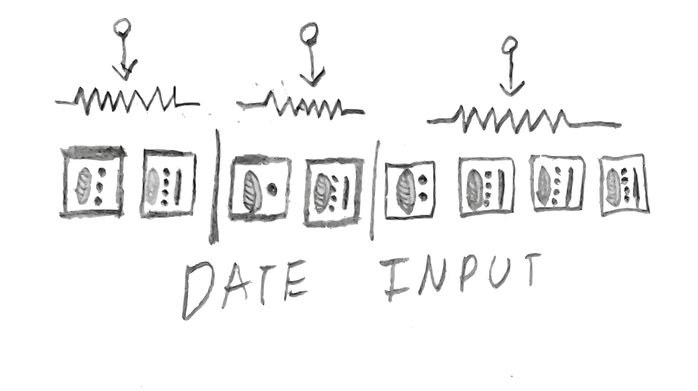
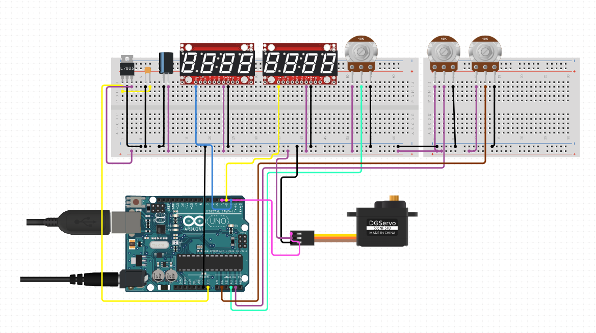
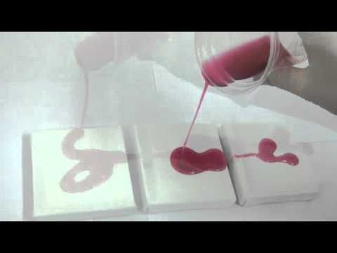
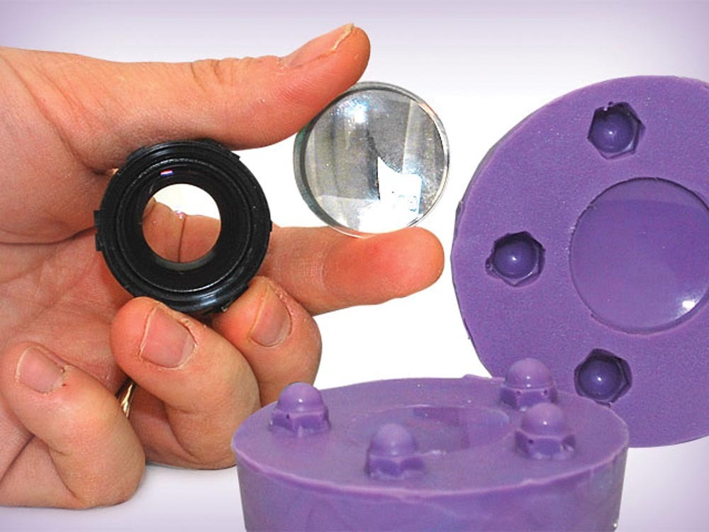
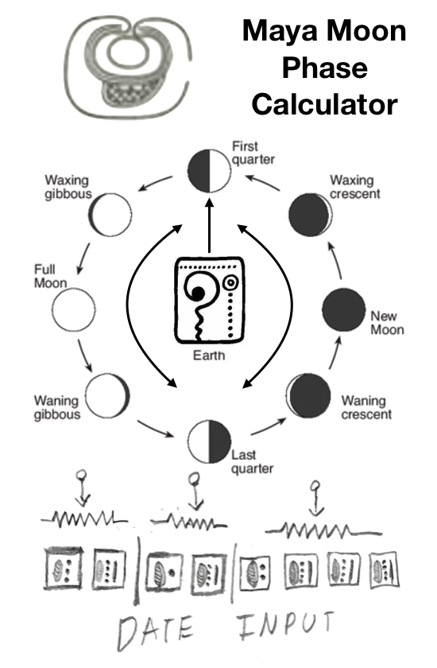
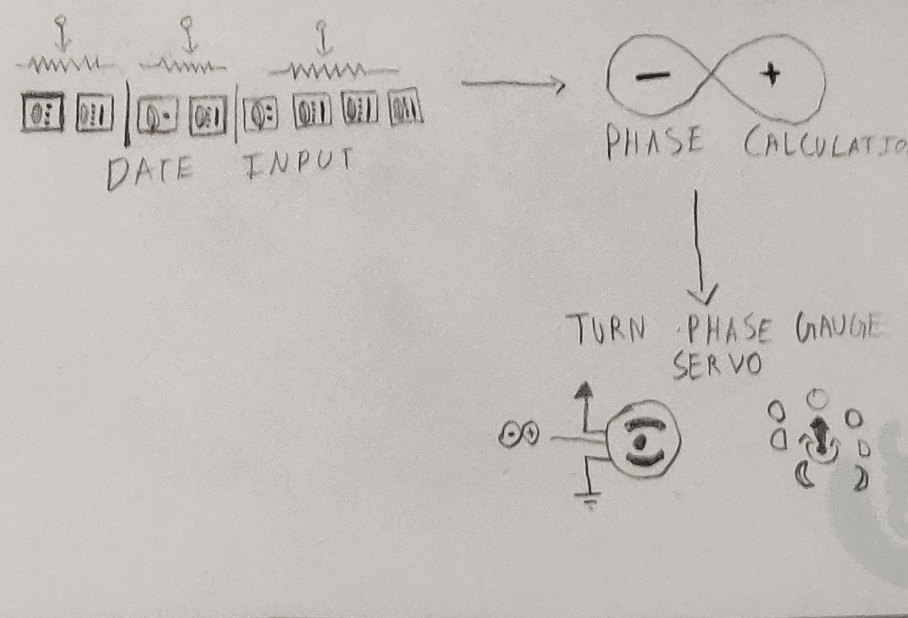

# 1701QCA Making Interaction - Assessment 2 workbook

When you have completed the template, submit the link to the GitHub Pages site for this repository as a link in Learning@Griffith. The link should be something like [https://qcainteractivemedia.github.io/1701QCA-Assessment2/](https://qcainteractivemedia.github.io/1701QCA-Assessment2/) where `qcainteractivemedia` is replaced with your GitHub username and `1701QCA-Assessment2` is replaced with whatever you called the repository this template is contained in when you set it up.

## Mayan Moon Phase Calculator (Prototype Version) ##

## Related projects ##

### Solar System Orrery (3D Printed) ###

*https://www.instructables.com/id/Solar-System-Orrery-3D-Printed/*

*An orrery is a mechanical model of the solar system that illustrates or predicts the relative positions and motions of the planets and moons, usually according to the heliocentric model. My project reflects these positions as phases denoting the position according to the day observed from
This project helped me visualize a design concept for my idea on how to represent the phases of the moon by spreading out the positions arround a model of the earth in the center*.

### DIY MAYAN CALENDAR ###

*https://woodtrick.com/product/mayan-calendar/*

This project initally sparked my interest behind making a celestial body phase calculator, the mayan calendar is designed with the perspective that the earth was in the center of the solar system and indicated the turn of yearly and monthly cycles based on the phases of the moon and sun from the view of an observer from the earth*.

### School Countdown Calendar ###

*https://www.instructables.com/id/School-Countdown-Calendar/*

This project has an LCD screen displaying the end date/time for the countdown, utilizes three 4-digit 7-segment display units connected to an Arduino Mega to utilize all the additional I/O pins. This project utilises a very similar the method I'll be trying to use in indicating the input date of the phase calculator using the 8 digits from the display. 

## Other research ##

## Mould making and Casting Techniques ##
*https://www.smooth-on.com/tutorials/*

* I intend on casting traditional symbols that the maya used to denote the moon and the sun, along with the number system they followed to indicate the date input. Mouldmaking/casting involves covering the object you want to copy in a material which will then become firm enough to be detached from it and keep its shape, so that a hollow space or negative of the object is left, which can then be filled with a casting material to make an exact replica of the shape.*

## Moon phases calculation algorithm ##
*https://gist.github.com/L-A/3497902*

* This is a pseudo code I found written in javascript that I intend on using to calculate that phase of the moon with the date as the input. Although I would have to translate this to java in order to implement the code within Arduino*

## Conceptual progress ##

### Design intent ###
*The design intent of this project is to showcase a thematic interactive intallation that calculates and visualizes the phase of the moon based on the date given by the user styled in mayan symbolic art.*

### Design concept 1 ###

*The diagram above depicts the overall outlook of the model from the position of the arrow gauge petruding from the middle earth symbol indicating the phase of the moon by rotating towards the assossiated phase position.*

### Design concept 2 ###

*The diagrams above depict the two possible concepts behind the date input method, one where the potentiometer knobs .*

### Final design concept ###

*The two main fabrication materials I've planned on using for this project ar clear casting epoxy and air drying clay. The epoxy requires the additional use of sillicone in order to make moulds for the casting process as epoxy tends to stick to raw clay moulds.*

*The diagram above shows the complete design concept beind the project.*

### Interaction flowchart ###

## Physical experimentation documentation ##

*In this section, show your progress including whichever of the following are appropriate for your project at this point.
a.	Technical development. Could be code screenshots, pictures of electronics and hardware testing, video of tests. 
b.	Fabrication. Physical models, rough prototypes, sketches, diagrams of form, material considerations, mood boards, etc.
Ensure you include comments about the choices you've made along the way.*

*You will probably have a range of images and screenshots. Any test videos should be uploaded to YouTube or other publicly accessible site and a link provided here.*

## Design process discussion ##
*Discuss your process in getting to this point, particularly with reference to aspects of the Double Diamond design methodology or other relevant design process.*

## Next steps ##
*Write a list or provide other information about your plan to move the project forward to be ready to present by video and documentation in week 12 of the course.*
