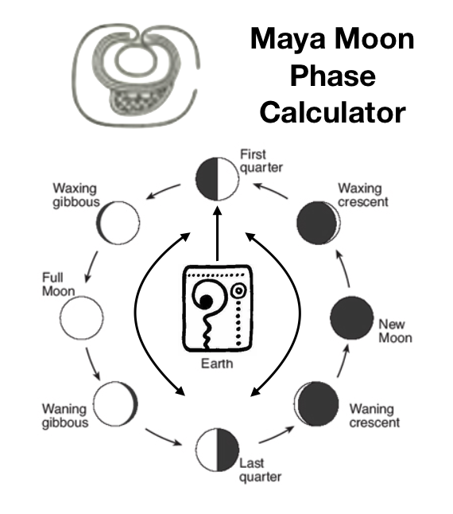

# 1701QCA Making Interaction - Assessment 2 workbook

## Mayan Moon Phase Calculator (Prototype Version) ##

## Related projects ##

### Solar System Orrery (3D Printed) ###

*https://www.instructables.com/id/Solar-System-Orrery-3D-Printed/*

*An orrery is a mechanical model of the solar system that illustrates or predicts the relative positions and motions of the planets and moons, usually according to the heliocentric model. My project reflects these positions as phases denoting the position according to the day observed from
This project helped me visualize a design concept for my idea on how to represent the phases of the moon by spreading out the positions arround a model of the earth in the center*.

### DIY MAYAN CALENDAR ###

*https://woodtrick.com/product/mayan-calendar/*

This project initally sparked my interest behind making a celestial body phase calculator, the mayan calendar is designed with the perspective that the earth was in the center of the solar system and indicated the turn of yearly and monthly cycles based on the phases of the moon and sun from the view of an observer from the earth*.

### School Countdown Calendar ###

*https://www.instructables.com/id/School-Countdown-Calendar/*

This project has an LCD screen displaying the end date/time for the countdown, utilizes three 4-digit 7-segment display units connected to an Arduino Mega to utilize all the additional I/O pins. This project utilises a very similar the method I'll be trying to use in indicating the input date of the phase calculator using the 8 digits from the display. 

## Other research ##

## Mould making and Casting Techniques ##
*https://www.smooth-on.com/tutorials/*

* I intend on casting traditional symbols that the maya used to denote the moon and the sun, along with the number system they followed to indicate the date input. Mouldmaking/casting involves covering the object you want to copy in a material which will then become firm enough to be detached from it and keep its shape, so that a hollow space or negative of the object is left, which can then be filled with a casting material to make an exact replica of the shape.*

## Moon phases calculation algorithm ##
*https://gist.github.com/L-A/3497902*

* This is a pseudo code I found written in javascript that I intend on using to calculate that phase of the moon with the date as the input. Although I would have to translate this to java in order to implement the code within Arduino*

## Conceptual progress ##

### Design intent ###
*The design intent of this project is to showcase a thematic interactive intallation that calculates and visualizes the phase of the moon based on the date given by the user styled in mayan symbolic art.*

### Design concept 1 ###

*The diagram above depicts the overall outlook of the model from the position of the arrow gauge petruding from the middle earth symbol indicating the phase of the moon by rotating towards the assossiated phase position.*

### Design concept 2 ###

*The diagrams above depict the two possible concepts behind the date input method, one where the potentiometer knobs .*

### Final design concept ###

*The two main fabrication materials I've planned on using for this project ar clear casting epoxy and air drying clay. The epoxy requires the additional use of sillicone in order to make moulds for the casting process as epoxy tends to stick to raw clay moulds.*

*The diagram above shows the complete design concept beind the project.*

### Interaction flowchart ###

## Physical experimentation documentation ##

*The Image above shows the circuit diagram plotted on top of the boad in which all of the elements of the project were assembled on.*

*The Images above show the mould making and casting experiments carried out for the project*

*Digital Display Test:*

*Digital Display Test:*

## Design process discussion ##
*One of the most unexpected difficulties that I faced on the road getting so far with the project was being able to factor in a well-planned schedule, while the conceptualising process did not take too long as I had a clear vision of what my project was to look like, it was extremely difficult to predict the time frame it would take to implement those ideas and especially with moulding making and casting involved.*

*Another aspect that slowed me down was simple troubleshooting of problems like malfunctioning damaged breadboards. This totally caught me unexpectedly and forced me to waste a lot of precious time on.*

## Next steps ##
*The next steps would include finishing of the parts from painting to assembly including final testing before recording.*
